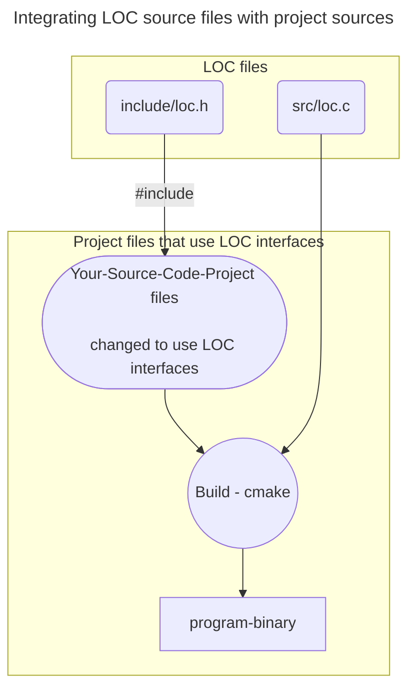

# LOC2 - Workflow based on ELF named-section

Leveraging the LOC machinery means using the `__LOC__`, `LOC_FILE()`,
`LOC_LINE()` and `LOC_FILE()` macros in your source files.

The typical workflow to incorporate the LOC2-machinery in your project is very
simple. It would be something as follows:

-----

-----

### LOC Development Workflow

Here are the typical steps to follow in your development workflow:

- Choose which source files the LOC-macros would be used in.  Typically,
  you would start by using the `__LOC__` macro to **encode** the code-location
  you wish to capture and trace for diagnostics.

  Then, you would use the `LOC_FILE()`, `LOC_LINE()` and `LOC_FUNC()` macros in your
  diagnostic / instrumentation code to **decode** the encoded code-location.

  The
  [unit-test-sources](../tests/unit/single_file_elf_src/single_file_prog_elf_test.c)
  are an example of how you would start using these annotations.

  - Add `#include "loc.h"` in the source files where the LOC decoding macros
    are used.

These steps should get you going to compile and build your project.

----