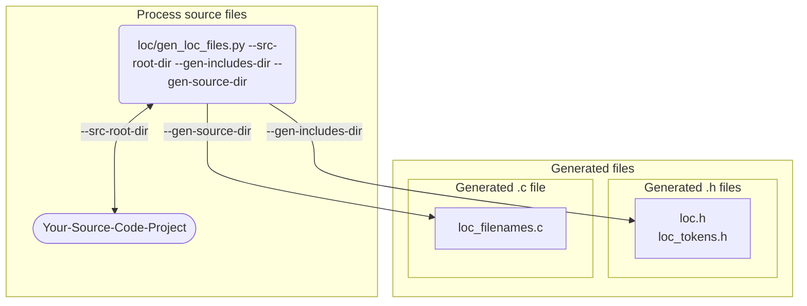
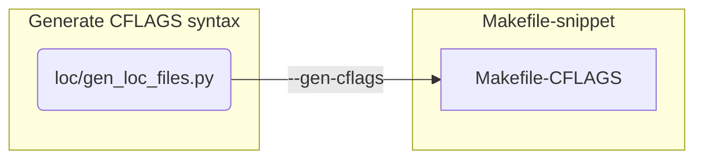
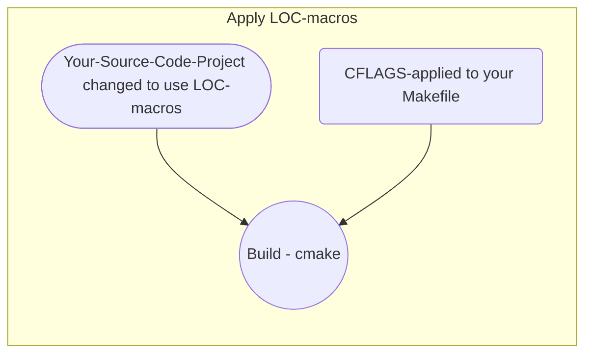
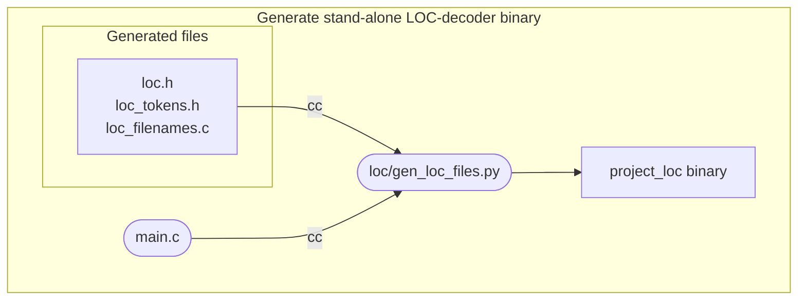

# LOC - Workflow

Leveraging the LOC machinery means using the `__LOC__`, `LOC_FILE()` and
`LOC_LINE()` macros in your source files.

The typical workflow to incorporate the LOC-machinery in your project would
be something as follows:

-----

### 1) Process all source files with Python script



This is a **one-time step** to process all source files in your code line to
generate a small collection of generated files that will need to be
incorporated to your build system.

### 2) Generate suggested Makefile CFLAGS syntax



This is a **one-time step** to generate the required additions to your `CFLAGS`
syntax which needs to be manually applied to your project's `Makefile` or `CMake`
files.


### 3) Apply LOC-macros in your source code

After these two steps, all source files in your project are now **enabled for use**
of the `LOC` macros. A normal make should successfully build your project's sources.



### 4) Stand-alone LOC-decoder binary

The Python script `loc/gen_loc_files.py` automatically generates a project-specific
standalone LOC-decoder binary. This binary is a simple utility to unpack an
encoded `loc_t` value, and emit to stdout, its constituent filename / line number.

This binary is named as `<Project>_bin`, where `Project`
is the basename of the source root-dir for the code-base to which you are
applying this LOC machinery. Currently this binary is generated in the default
$TMPDIR (`tempfile.gettempdir()`) for your Python environment.



A sample output from the build process showing the generation of this binary is shown below:

```
Macintosh:[138] $ ./loc/gen_loc_files.py --src-root-dir test-code/single-file-cpp-program/ --verbose
Generated /var/folders/b9/dyhp_3yj5kj21_4mydg066k00000gn/T/loc_tokens.h
Generated /var/folders/b9/dyhp_3yj5kj21_4mydg066k00000gn/T/loc_filenames.c
Generated /var/folders/b9/dyhp_3yj5kj21_4mydg066k00000gn/T/loc.h
Generated /var/folders/b9/dyhp_3yj5kj21_4mydg066k00000gn/T//single-file-cpp-program_loc.c
Generated /var/folders/b9/dyhp_3yj5kj21_4mydg066k00000gn/T/single-file-cpp-program_loc
```

In this example, the project's source root-dir is `./test-code/single-file-cc-program`.

So, the stand-alone decoder binary is named `single-file-cc-program_loc`.

-----

### LOC Development Workflow

Here are the typical steps to follow in your development workflow:

- Choose which source files the LOC-macros would be used in.  Typically,
  you would start by using the `__LOC__` macro to **encode** the code-location
  you wish to capture and trace for diagnostics.

  Then, you would use the `LOC_FILE()` and `LOC_LINE()` macros in your
  diagnostic / instrumentation code to **decode** the encoded code-location.

  The
  [unit-test sources](./tests/unit/single_file_src/single_file_prog_test.c)
  are an example of how you would start using these annotations.

  - Add `#include "loc.h"` in the source files where the LOC decoding macros
    are used.

- Run the [gen_loc_files.py](../../loc/gen_loc_files.py) tool with the
  `--verbose` option to see where the files are generated.

  - Customize the location of these generated files to fit the needs of
    your codeline's build system, using the `--gen-includes-dir` and
    `--gen-source-dir` arguments.


- Run the tool with the `--gen-cflags` argument. This generates a suggested
  Makefile `CFLAGS` clause. You will **need to apply** the suggested Makefile
  `CFLAGS` clause to your project's `Makefile` `CFLAGS` clause in order to
  successfully compile those source files that _were changed_ to use the
  LOC macros.

- You can see the [CFLAGS](./Makefile#:~:text=DLOC%5FFILE%5FINDEX)
  implemented in this repo's Makefile to get an idea of how-to incorporate
  the suggested `CFLAGS` clause.

- Update your project's Makefile to compile and link the
  `loc_filenames.c` with your project's binary. As the Make-rules may vary
  based on your build system, the Python script does not provide any
  suggested syntax to compile and link this file.

These steps should get you going to compile and build your project.

----
## Automation

You can automate to some extent this workflow as follows:

- Use the `--gen-includes-dir` argument to specify the `include/`
  files directory for your project. (It's preferable to specify the
  full directory path.) The `.h` files will be generated at this
  location and will, then, be accessible when `#include`-ed in the
  source files which use the LOC macros.

- Use the `--gen-source-dir` argument to specify the `src/`
  files directory for your project. (It's preferable to specify the
  full directory path.) The `.c` file(s) will be generated at this
  location.

  - The generated `loc_filenames.c` file should be included in the
    list of files that are compiled and linked into your project's
    binary.

  - The project-specific generated `<project>_loc.c` file is linked
    with `loc_filenames.c` to build a standalone decoder binary.
    The Python script does this, by default. You can use the
    decoder binary to unpack encoded LOC-int values to their
    constituent file name and line number.

    This `<project>_loc.c` file should **not** be included in the list
    of files linked with your project as it is a standalone
    program with its own `main()`.

- For most cases, the `CFLAGS` clause suggested by the Python script
  can be used directly to invoke your project's `make`, as:

  ```shell
  $ CFLAGS='-DLOC_FILE_INDEX=$(patsubst %.c,LOC_%_c,$(notdir $<))' make
  ```

  This will usually work as the expected convention is that most
  `Makefile`s define their `CFLAGS` as `CFLAGS += ...`

- You can further automate this using the `--gen-cflags` argument
  which will print the suggested `CFLAGS` clause.
  ```shell
  $ ./gen_loc_files.py --src-root-dir ~/Project --gen-cflags
  ```

- Assume that the LOC packages lives at `~/LOC`. And that the `Makefile`
  for your source code project lives at `~/Project/Makefile`.

  A typical full invocation of the Python script to process your source
  code repository and to suggest the `Makefile` clause required to compile
  all sources (that may eventually use LOC-macros) would be something
  on the lines of:
  ```shell
  $ cd ~/Project

  $ export CFLAGS=$(~/LOC/loc/gen_loc_files.py              \
                    --gen-includes-dir ~/Project/include    \
                    --gen-source-dir ~/Project/src         \
                    --src-root-dir ~/Project                \
                    --gen-cflags)
  $ make
  ```
- In some cases, described below, you may have to do a one-time
  hand-edit of your project's `Makefile` to add the suggested
  `CFLAGS` clause:

   - If you have a complex set of Make rules
   - If there are some duplicate conflicts in your project's
     sources, which get disambiguated by the Python script to
     avoid conflicts in the generated LOC-token names.

     In this case, the suggested `CFLAGS` may be complex,
     and may list source files that will never use the LOC-macros.
     In such cases, you may have to custom-edit the suggested
     `CFLAGS` accounting for actual, and potential future, usages
     of the LOC-macros in source files with duplicate file names.

------
